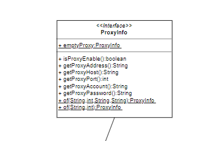
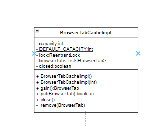
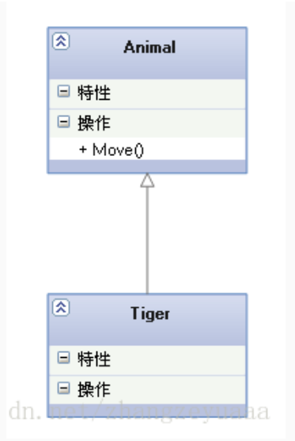
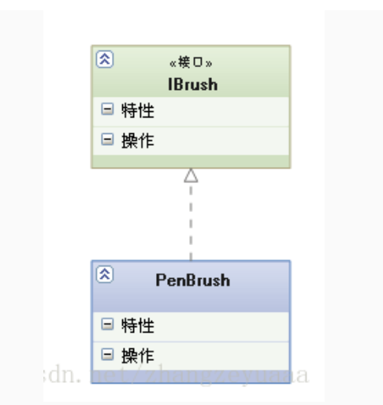
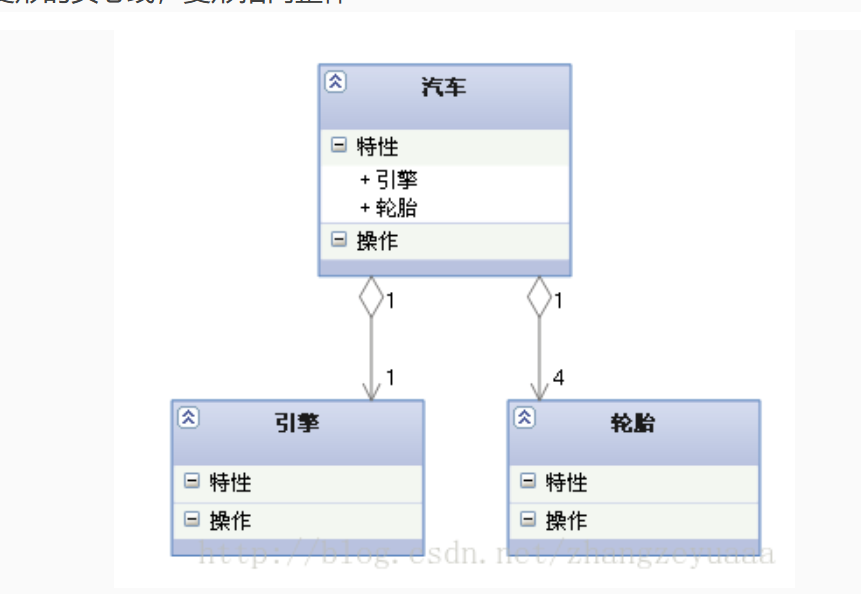
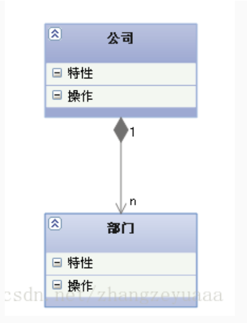
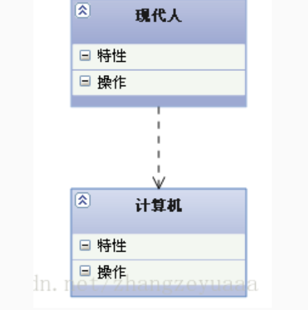

#### 接口

#### 类

#### 类图的六种关系
1. 泛化关系（Generalization）：继承关系，表示一般与特殊的关系，是一种继承关系，它指定了子类如何特化父类的所有特征和行为。例如：老虎是动物的一种，即老虎继承了动物的特性。

2. 实现关系（Realization）：接口与实现类之间的关系，表示类与接口之间的关系，表示类是接口所有特征和行为的实现。例如：学生和老师都是人，即学生和老师实现了人这个接口。

3. 关联关系（Association）：类与类之间的关系，表示对象之间的结构关系，一个类与另一个类之间有联系。例如：老师与学生之间存在关联关系。

4. 聚合关系（Aggregation）：整体与部分的关系，是关联关系的一种，表示整体与部分的关系，且部分可以离开整体而单独存在。例如：车和轮胎之间的关系，车可以有轮胎，也可以没有轮胎，轮胎可以被多辆车共享。

5. 组合关系（Composition）：整体与部分的关系，是关联关系的一种，表示整体与部分的关系，但部分不能离开整体而单独存在。例如：公司和员工之间的关系，员工离开公司就失去了员工的意义。

6. 依赖关系（Dependency）：类与类之间的关系，表示一个类依赖于另一个类的关系。例如：学生依赖于老师，学生需要老师教授知识。

